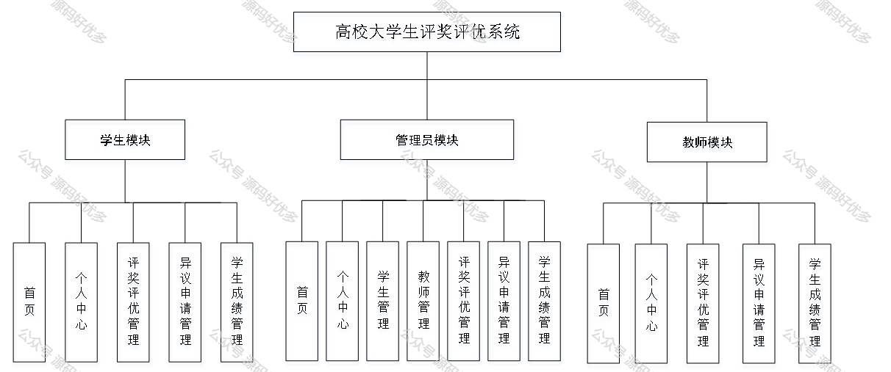
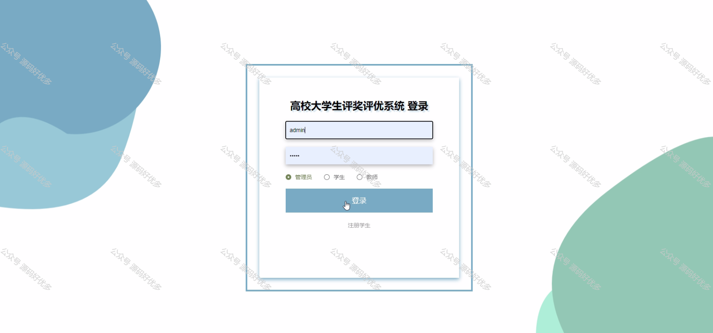
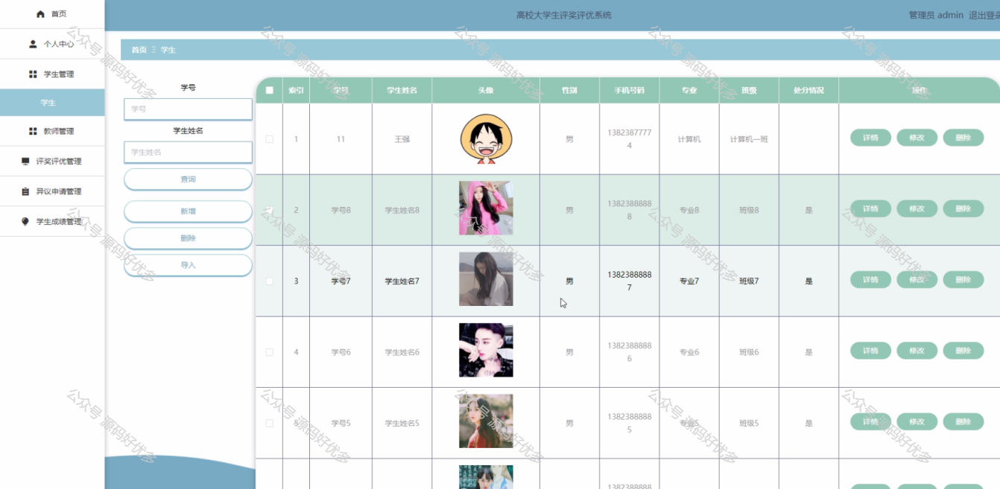
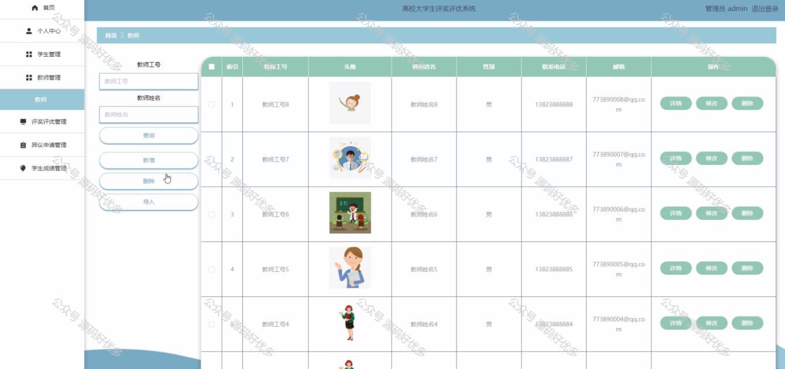
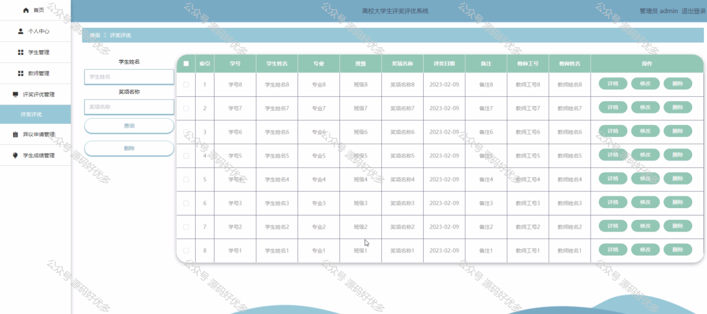
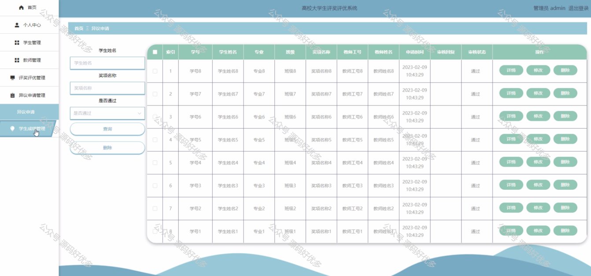
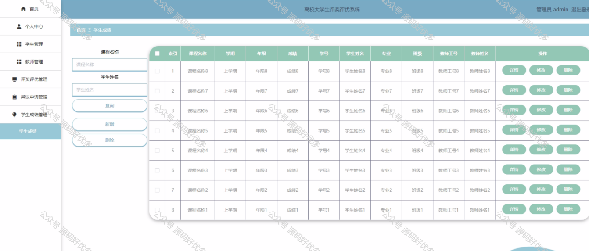
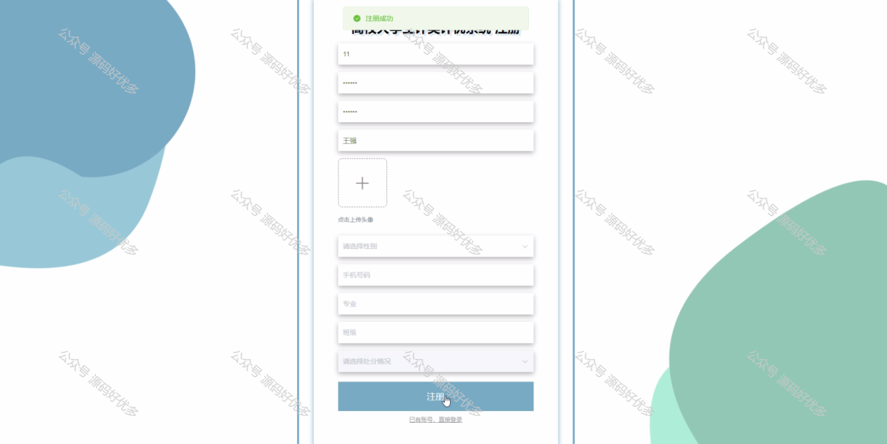
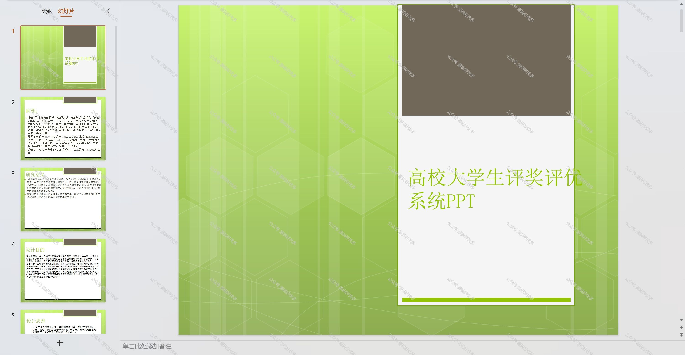
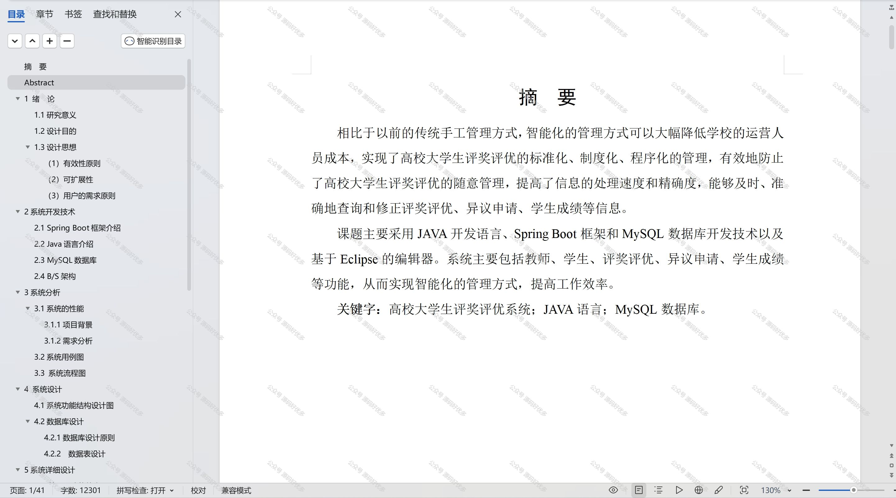

 
## 查看主页获取源码

### 一、作品包含

源码+数据库+设计文档万字+PPT+全套环境和工具资源+部署教程

### 二、项目技术

前端技术：Html、Css、Js、Vue、Element-ui

数据库：MySQL

后端技术：Java、Spring Boot、MyBatis

  

### 三、运行环境

开发工具：IDEA/eclipse

数据库：MySQL5.7

数据库管理工具：Navicat10以上版本

环境配置软件： JDK1.8+Maven3.6.3

前端Nodejs：14

### 四、项目介绍
项目编号：springbootA159

高校大学生评奖评优系统的背景在于优化和规范学生评价体系，通过科学、公正的评选机制激励学生全面发展，提升教育质量。随着教育改革的深入，高校对于学生的综合素质评价越来越重视，传统的评奖评优方式存在主观性强、效率低下等问题，因此，开发一套系统化、标准化的评奖评优系统成为迫切需求，它有助于实现评选过程的透明化，确保评选结果的公平性，同时促进学生积极向上的学习氛围。

系统分为管理员、学生、教师
管理员的功能：首页、个人中心、学生管理、教师管理、评奖评优管理、异议申请管理、学生成绩管理。
学生的功能：首页、个人中心、评奖评优管理、异议申请管理、学生成绩管理。
教师的功能：首页、个人中心、评奖评优管理、异议申请管理、学生成绩管理。

### 五、运行截图

  
